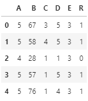

# Neural networks

## In this repository you will found:
- Classification with NN
- Regression with NN
- Times Series forecasting with NN
## Classification
    The mammography dataset is used to the classification problem. This dataset has five features 'A','B','C','D' and 'E' that are relevant to cancer diagnostic and 'R' class that represents cancer if '1' and not cancer if '0'

     Training a NN build with MLPClassfier from scikit-learn, using 'A',  'B', 'C', 'D' and 'E' as input, and R as output.

## Regression
   To regression, the friction curves was used from two dataset are builded using arrays from -10 to 10 with different steps; 0.05 to train data and 0.01 to test data

    y = f(x)

## Forecasting
    To times series forecasting, wind series from april/1992 and may/1992

    t, t1, t2 ,t2, t3,.., t600,.., tn

    As from the datasets lagged matrix are builded to train, validation and test the NN.
    

    'A-1', 'A-2', 'A-3', 'A-4', 'A-5', 'A-25', 'A-200' are inputs and 'A' is the output

    each tn are predicted as from

    tn-1, tn-2, tn-3, tn-5, tn-25, tn-200  -> tn

    April dataset was used to train NN, May wind series dataset was splited in validation/test datasets.
